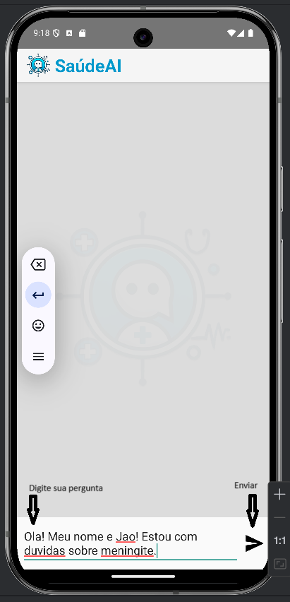
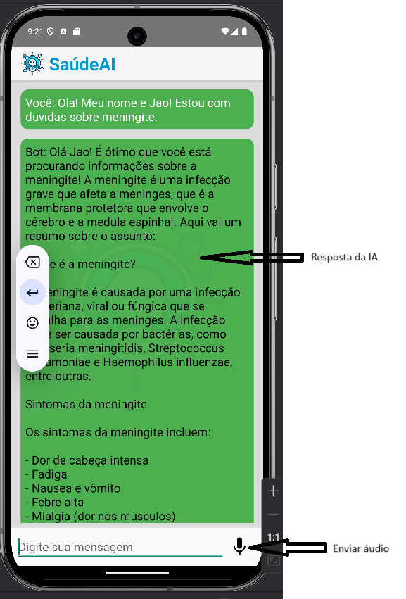

# SaudeAI-App

Nesse projeto estarei usando a Api em Python  
GitHub: [https://github.com/FERNANDO-MATSUHASHI/ChatLlamaAPI-QDrant.git](https://github.com/FERNANDO-MATSUHASHI/ChatLlamaAPI-QDrant.git)

# Descrição

Link GitHub: [https://github.com/FERNANDO-MATSUHASHI/SaudeAI-App.git](https://github.com/FERNANDO-MATSUHASHI/SaudeAI-App.git).  

Aplicativo desenvolvido em Kotlin (Jetpack Compose) de um Chat voltado para a Saúde, com o intuito de ajudar pessoal com dúvidas na área, usando a inteligência artificial do Llama 3.1-8b.

# Tecnologias

- Kotlin Version: 8.7.2
- Android Studio Ladybug | 2024.2.1 Patch 2

# Como funciona
Aqui explicarei como funciona o SaudeAi-App

## Tela inicial

## Tela resposta

# Configuração do Projeto

## Instale o Android Studio

Link Android Studio: [https://www.googleadservices.com/pagead/aclk?sa=L&ai=DChcSEwj90Mzgp-SJAxX4EEQIHdGyPIkYABAAGgJkeg&ae=2&aspm=1&co=1&ase=2&gclid=CjwKCAiAxea5BhBeEiwAh4t5KxjR77eGMxolS1TqwZkAxGRzLOD2moRratABf9KVIkaO0bTrVmznXRoCQGIQAvD_BwE&ohost=www.google.com&cid=CAESVuD2UIDp89yLifFntRRhIC6r1KDUsO6HWjWp_Hp3rIwetD8wE6ChBn5AOxQ3Yju3dtdXcxIQo4gaicRPasS88XEQWK4QAkm3LEl1Udy2Z1eOi9e99FJD&sig=AOD64_3gjZvQJso22Kpgk4BX2AVyR05b0g&q&nis=4&adurl&ved=2ahUKEwiqqsLgp-SJAxUgpZUCHYaeJXIQ0Qx6BAgKEAE](https://www.googleadservices.com/pagead/aclk?sa=L&ai=DChcSEwj90Mzgp-SJAxX4EEQIHdGyPIkYABAAGgJkeg&ae=2&aspm=1&co=1&ase=2&gclid=CjwKCAiAxea5BhBeEiwAh4t5KxjR77eGMxolS1TqwZkAxGRzLOD2moRratABf9KVIkaO0bTrVmznXRoCQGIQAvD_BwE&ohost=www.google.com&cid=CAESVuD2UIDp89yLifFntRRhIC6r1KDUsO6HWjWp_Hp3rIwetD8wE6ChBn5AOxQ3Yju3dtdXcxIQo4gaicRPasS88XEQWK4QAkm3LEl1Udy2Z1eOi9e99FJD&sig=AOD64_3gjZvQJso22Kpgk4BX2AVyR05b0g&q&nis=4&adurl&ved=2ahUKEwiqqsLgp-SJAxUgpZUCHYaeJXIQ0Qx6BAgKEAE). 

